# chrome-gitlab-enhancer

This Google Chrome extension enhances your GitLab experience by validating issue information & tracking unresolved threads in merge requests.

## ✨ Features

**General**

- Enable/disable most of the features by toggling the preferences
- Move the close issue / merge request button to the right side to prevent accidental clicks
- Highlight my issues & merge requests

**Command panel**

- Render starred projects
- Move "Places" after "Frequently visited ..."

**Merge Requests**

- Show unresolved threads in the overview
- Show unresolved threads **created by you** in the overview
- Show unresolved threads **created by you** in the detail, with scrollTo buttons
- Add hotkey `Shift+J` to mark a changed file as "viewed" and go to next page
- Dim "Draft" merge requests

**Issues**

- Render project avatar in issue overview & board when viewed in groups
- Validate incomplete issues in issue detail (e.g. missing iteration, weight, specific labels, ...)
- Show unresolved threads in the detail
- Show unresolved threads **created by you** in the detail, with scrollTo buttons

## 💿️ Installation

Follow the steps below to install this extension:

1. Clone this project
2. Run `npm install`
3. Run `npm run build`, you should now have a **dist** folder
4. Open [chrome://extensions](chrome:://extensions)
5. Enable `Developer Mode`

   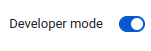
6. Click `Load unpacked` and choose the **dist** folder

   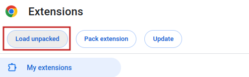
7. Finished ✨

   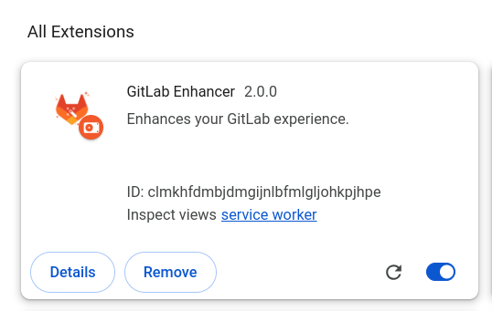

## 🔄 Updating

Follow the steps below to update the extension:

1. `git pull` changes from this repo
2. Run `npm run build`
3. Open [chrome://extensions](chrome:://extensions)
4. Click on the `Refresh` button

   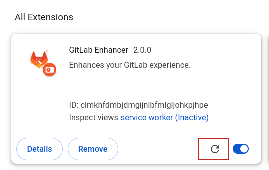

## ⚙️ Preferences

Click on the "GitLab Enhancer" dropdown to customize the settings:

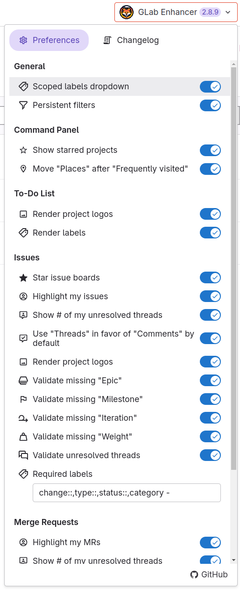

## 👀 Preview

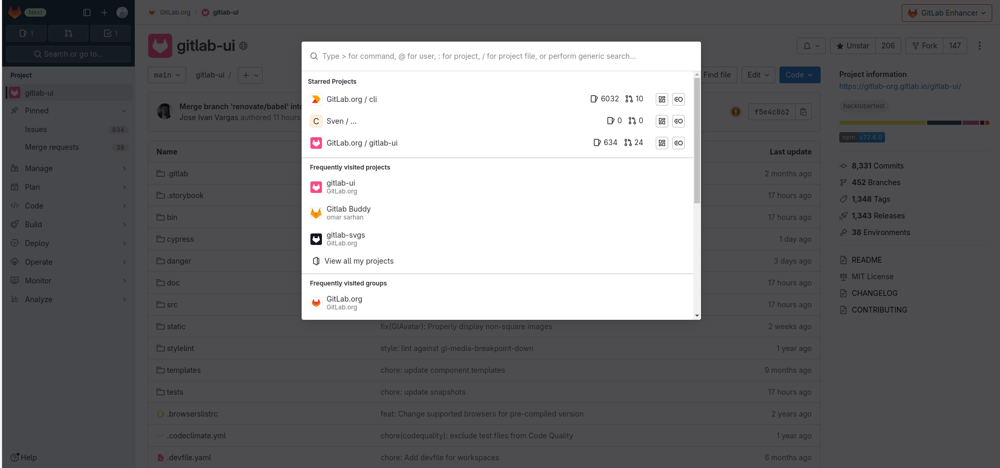

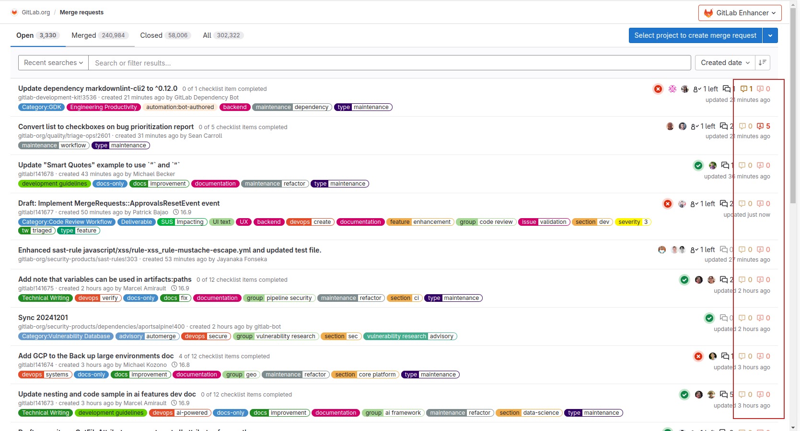

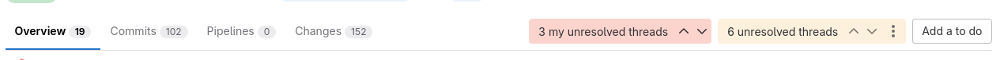

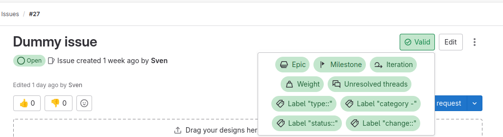

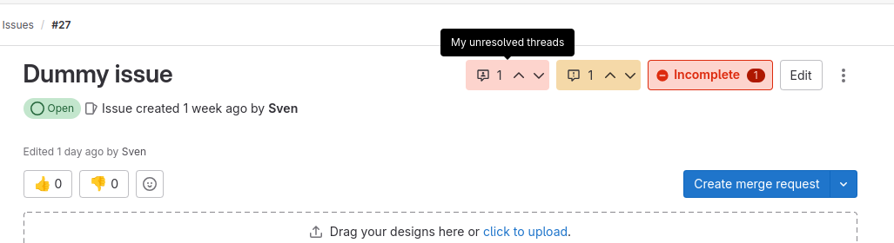

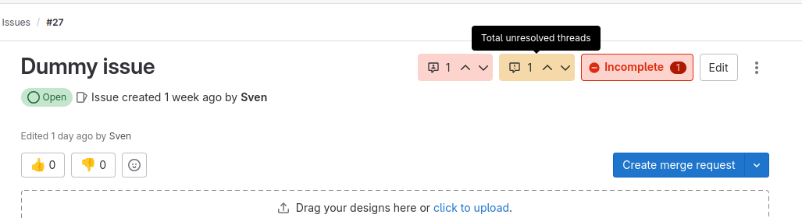
